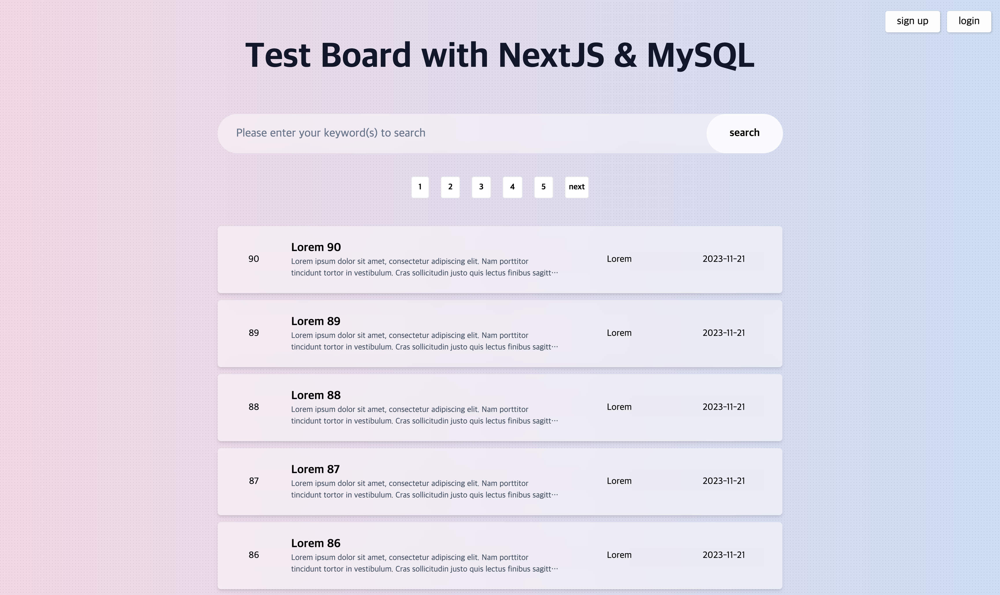

# NextJS와 MySQL를 활용한 게시판

배포 링크 : https://next-js-my-sql-board.vercel.app/

## 기술 스택

- NextJS
- Typescript
- MySQL
- Next Auth
- Planetscale
- Tailwind
- Postman
- Vercel

## 현재 개발을 진행하면서...

1. Next.js, MySQL, 그리고 PlanetScale에 대한 숙련도가 상대적으로 낮아 연습을 위해 테스트용 게시판을 개발해 보았습니다. 서버 사이드 렌더링(SSR), API 개발, SQL, Serverless 서비스의 장단점을 체험할 수 있어 매우 유익한 경험이었습니다.

2. 애니메이션 인터랙션은 아직 진행하지 않았습니다. 유저의 UX를 향상시키는 데 어떤 방식으로 개발해야 할지에 대한 고민이 많습니다. UI 레퍼런스들을 좀 더 수집해 보고, 아름다우면서도 동시에 편리한 경험을 제공한 기능들을 클론해 봐야 되겠습니다.

3. Next Auth는 문법이 직관적이고 사용하기 편해서, 향후 회원가입이나 로그인 기능을 구현할 때 자주 활용할 것으로 예상됩니다.
  
4. 인기 게시물이나, 텍스트 에디터, 게시물 필터 등 다양한 기능들을 추가해보고 있습니다. 일반 유저가 사용할 수 있는 서비스의 개발이 끝나면, 관리자 페이지를 만들어 보아도 좋을 것 같습니다.
